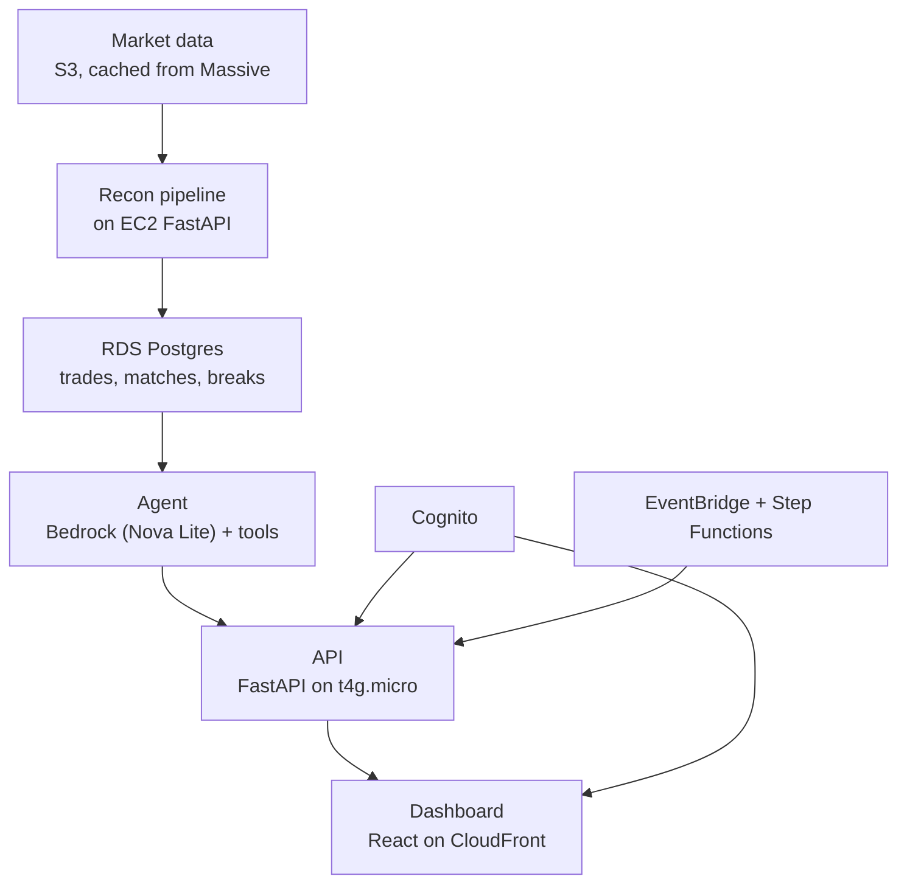

# Trade Reconciliation Platform — Project Plan

**Status:** Product hardening — Cognito auth, CloudFront-only API edge, scheduled recon. Steps 1–8 complete. See `infra/README.md`.
**Purpose of this doc:** the full design record. `AGENTS.md` is the short, operational file coding agents read day-to-day — this file is the "why" behind it. Update this as decisions change; treat it as a living document, not a spec frozen in time.

---

## 1. What this is

A two-sided trade reconciliation system, for a portfolio. Two records of the same trades — a clearing broker's report and an internal trading desk's blotter — get compared. Mismatches ("breaks") are detected deterministically, then handed to an AI agent that investigates and proposes a resolution, which a human approves before anything is marked resolved.

**Portfolio goal:** full-stack (backend + dashboard/UI), full pipeline + dashboard scope.

**The core design principle, stated once so it doesn't get lost:** anything with an objectively correct answer (does this quantity match, does this price match within tolerance) is deterministic Python. Anything requiring judgment (why did this happen, what should we do) goes to the agent. The agent never does arithmetic on money, and never writes directly to trade tables.

---

## 2. Architecture



### AWS service mapping
| Layer | Service |
|---|---|
| File / data landing | S3 (existing market-data bucket) |
| Pipeline compute | FastAPI on EC2 t4g.micro (same process as the API) |
| Orchestration | EventBridge (weekdays) + standard Step Functions (one Task) |
| Database | Existing RDS Postgres `trade-recon-postgres` (+ `pgvector`) |
| Agent | Amazon Bedrock (Nova Lite default) |
| API | CloudFront `/api/*` → EC2 origin (prefix-list locked) |
| Frontend | S3 + CloudFront |
| Auth | Cognito user pool (email/password, custom React login) |
| Secrets | Secrets Manager + SSM SecureString |
| Logs / metrics | CloudWatch |
| Infra as code | **AWS CDK (Python)** under `infra/` |

**Why Bedrock over the raw Anthropic API:** keeps everything inside the AWS account/VPC, no third-party API egress — the reason real financial firms lean this way. Worth a line in the README.

---

## 3. Data source strategy

No firm publishes real broker-vs-desk reconciliation data — it's confidential, and the "firm" in this project doesn't exist. So both legs are synthetic, but **derived from real market data** rather than randomly generated:

- **Primary source: Massive (formerly Polygon.io).** Free tier — EOD daily bars, splits, dividends, market calendar, ~2 years of history. Splits/dividends endpoints confirmed free on all plans.
- **Cross-check only: yfinance.** Free, no key. Used to spot-check corporate action dates against a second source — not the source of record.
- **Fetch once, cache to S3 as Parquet.** The pipeline never makes a live external call. This also sidesteps yfinance's tendency to get rate-limited without warning.
- **Corporate-action-driven breaks are real, not injected.** A split processed by the broker but not yet by the internal system produces a genuine quantity mismatch. Other break types (missing trade, price break, duplicate, settlement date mismatch, split fills) are injected at controlled rates during synthetic trade generation.

**README line that captures this honestly:**
> Trades are synthetic — no firm publishes internal blotters — but are generated against real market data: actual prices, volumes, trading calendars, and corporate actions. Split-related breaks are real, not injected.

---

## 4. Data model

| Table | Holds |
|---|---|
| `raw_broker_trades` | Ingested broker file, untouched |
| `raw_desk_trades` | Ingested desk file, untouched |
| `normalized_trades` | Both sides, canonical schema, `source` column |
| `matches` | Successful pairings + which pass caught them |
| `breaks` | Unmatched / mismatched, with break type |
| `resolution_suggestions` | Agent output, one row per break |
| `audit_log` | Who approved what, when, override notes |
| `agent_memory` | Semantic memory notes + embeddings (see §6.4) |

Raw and normalized trades are kept separate deliberately — it's what lets you prove normalization didn't silently mangle anything.

---

## 5. Pipeline (deterministic layer)

Pure functions over dataframes. No LLM, no network calls. Fully unit-testable — this is the part that must never be wrong.

**Flow:** ingest → normalize → match (exact key, then tolerance-based) → unmatched/mismatched become breaks → breaks get clustered before handoff to the agent.

**Break types to handle:** missing trade (one-sided), quantity break, price break (tolerance band, not exact), duplicate trades, settlement date mismatch, one-to-many (block trade booked as one internal trade, multiple broker fills).

**Test coverage should include:** each break type above, plus a clean match, plus a corporate-action-driven quantity mismatch that should NOT be flagged as an error.

---

## 6. Agent (judgment layer)

### 6.1 Tools — read-only, parameterized, no free-form SQL

| Tool | Queries | Used when |
|---|---|---|
| `get_corporate_actions` | Cached splits/dividends (S3) | Quantity/price break — checking for a real split/dividend |
| `get_market_session_info` | Cached trading calendar | Break near a holiday, early close, or timing issue |
| `get_trade_history` | `normalized_trades` | Checking for a pattern on this symbol/desk |
| `get_similar_resolved_breaks` | `breaks` + `resolution_suggestions` + `audit_log` | Checking for an exact-type precedent |
| `search_similar_breaks` | `agent_memory` (HITL decision rows, pgvector) | Top-k similar Approve/Reject cases |
| `get_desk_metadata` | Desk reference table | Context on whether this desk is normally clean |
| `get_raw_records` | `raw_broker_trades` + `raw_desk_trades` | Wants the untouched originals, not just the diff |
| `get_relevant_memory` | `agent_memory` (pgvector similarity) | Checking for a synthesized pattern, not an exact case |

Hard cap: 5 tool calls per break. Bounds cost and prevents wandering.

### 6.2 Skills — how it reasons, not what it fetches

Structured as `SKILL.md` folders (Anthropic's Agent Skills format — YAML frontmatter + instructions). Since this agent handles one narrow task rather than open-ended work, skills are concatenated into the system prompt at build time rather than relying on runtime dynamic discovery (check current Bedrock support before depending on managed dynamic loading specifically).

| Skill | Job |
|---|---|
| `break-triage` | Decide investigation path — which tool first, given the break's shape |
| `corporate-action-analysis` | Does the quantity ratio actually match the split factor? |
| `root-cause-classification` | Map evidence onto the fixed enum, with tie-breaking rules |
| `resolution-recommendation` | Root cause → standard playbook action |
| `explanation-writing` | House style for the analyst-readable summary |
| `confidence-calibration` | Explicit rules: single strong signal vs. conflicting vs. none |

### 6.3 Output contract

```json
{
  "break_id": "uuid",
  "root_cause": "enum",
  "confidence": 0.0,
  "explanation": "2-3 sentences, analyst-readable",
  "suggested_action": "enum",
  "evidence": [
    {"tool": "string", "result_summary": "string"}
  ]
}
```

Enums, not free text, for `root_cause` and `suggested_action` — otherwise dashboard aggregations break. `evidence[]` must trace to actual tool results — an analyst reading the dashboard needs to see *why*, not just *what*.

### 6.4 Memory — automatic, two-layer

- **HITL decision rows (primary):** after a successful human **Approve**, **Reject**, or **Override**, upsert one `agent_memory` row keyed by `audit_id` (break type, desks, symbol, `root_cause`, `suggested_action`, outcome, actor note, notional band, `pair_id`). Embed with Titan (`amazon.titan-embed-text-v1`, 1536-d). If embedding fails, still store the row with a null vector so parameterized recall works. Never skip `audit_log`.
- **Deterministic rollups (optional):** plain SQL aggregates (break frequency by desk/symbol/root_cause, override rate by root cause). Cheap, zero hallucination risk. Off on the nightly job by default.
- **Semantic notes (opt-in):** short LLM-written summaries. **Not** the weekday 07:00 default — do not run a large nightly Converse job.

```sql
CREATE TABLE agent_memory (
    memory_id UUID PRIMARY KEY,
    scope TEXT,              -- 'decision:<audit_id>' for HITL rows; also 'desk:12', 'symbol:AAPL', 'global'
    memory_type TEXT,        -- 'pattern', 'incident', 'override_reason'
    content TEXT,
    embedding VECTOR(1536),
    source_break_ids UUID[],
    audit_id UUID UNIQUE,    -- HITL idempotency
    facts JSONB,             -- structured fields for parameterized retrieve
    created_at TIMESTAMPTZ
);
```

**Write vs read:** write on human decision (and a cheap 07:00 backfill for any audit missing a row). Read on Investigate via `search_similar_breaks` / `get_relevant_memory` (counts toward the 5-tool cap).

**Nightly job:** EventBridge 07:00 UTC → SSM `write-agent-memory`. Default: Titan-embed missing HITL rows, **skip if caught up**, no Converse. Approve-time write keeps this cheap.

**Guardrail:** memory is a prior, not a verdict. The agent must treat a retrieved note as a hypothesis to check against this break's actual evidence, not a shortcut. Bias `root_cause` / `suggested_action` toward pinned enums only.

**Retention:** granular *non-HITL* notes older than 90 days get compacted into a monthly summary. Decision rows (`audit_id` set) are kept.

### 6.5 Human-in-the-loop guardrails

- Agent writes only to `resolution_suggestions`. Never to `trades`, `matches`, or `breaks`.
- Every approval writes an `audit_log` row — who, when, agent's suggestion, accepted or overridden, override note.
- Confidence + notional size decide routing: high confidence + low notional → one-click approve. Low confidence or large notional → forced manual review, evidence expanded by default.
- Breaks are clustered before the agent sees them — one representative per cluster investigated, result applied across the cluster with an "inferred" flag.

---

## 7. Dashboard

- Summary cards — total trades, % clean-matched, breaks by type, notional at risk
- Filterable breaks table (desk, symbol, break type, date)
- Break detail — side-by-side diff of broker vs. internal record, plus the agent's suggestion panel (root cause, confidence, explanation, evidence)
- Approve / reject with note
- "Run reconciliation" button — triggers a live pipeline run for the demo

---

## 8. Repo structure

```
trade-recon/
├── project_plan.md
├── AGENTS.md
├── CLAUDE.md
│
├── infra/                        # AWS CDK (Python)
│   ├── app.py
│   ├── cdk.json
│   ├── stacks/
│   ├── lambda_stubs/
│   └── step_functions/
│       └── recon_pipeline.asl.json
│
├── backend/
│   ├── pipeline/                 # deterministic — Lambda handlers
│   │   ├── ingest.py
│   │   ├── normalize.py
│   │   ├── matcher.py
│   │   └── rules.py
│   │
│   ├── agent/                    # judgment layer
│   │   ├── runner.py
│   │   ├── tools.py
│   │   ├── clustering.py
│   │   ├── memory_writer.py
│   │   ├── enums.py
│   │   └── skills/
│   │       ├── break-triage/SKILL.md
│   │       ├── corporate-action-analysis/SKILL.md
│   │       ├── root-cause-classification/SKILL.md
│   │       ├── resolution-recommendation/SKILL.md
│   │       ├── explanation-writing/SKILL.md
│   │       └── confidence-calibration/SKILL.md
│   │
│   ├── api/                      # FastAPI, API Gateway + Lambda
│   │   ├── main.py
│   │   ├── models.py
│   │   ├── schemas.py
│   │   └── routes/
│   │       ├── recon.py
│   │       ├── breaks.py
│   │       └── resolutions.py
│   │
│   ├── data/
│   │   ├── fetch_market_data.py  # Massive primary, yfinance cross-check
│   │   └── generator.py          # synthetic trades from cached market data
│   │
│   └── tests/
│       └── test_matcher.py
│
└── frontend/
    └── src/
        ├── pages/
        │   ├── Dashboard.jsx
        │   ├── Breaks.jsx
        │   └── BreakDetail.jsx
        └── components/
            ├── SummaryCards.jsx
            ├── BreaksTable.jsx
            ├── TradeDiff.jsx
            └── AgentPanel.jsx
```

---

## 9. Build order

- [x] 1. Massive fetch script → cache to S3 (Parquet); yfinance cross-check on splits
- [x] 2. Synthetic trade generator — derive both legs from cached market data, inject non-corporate-action breaks
- [x] 3. RDS schema + normalization (SQLAlchemy models, local Parquet + optional Postgres; Lambda wiring later)
- [x] 4. Matcher (exact → tolerance) + unit tests (Lambda / Step Functions wiring in step 8)
- [x] 5. API Gateway + FastAPI endpoints (local uvicorn + RDS; Mangum/API Gateway in step 8)
- [x] 6. Agent — JSON-only output first, then tools one at a time, then skills, then memory
- [x] 7. React dashboard (local Vite; CloudFront in step 8)
- [x] 8. **CDK (Python)** — CloudFront+S3 frontend; FastAPI on t4g.micro in the RDS VPC (`TradeReconEc2Api`); no NAT; RDS not `0.0.0.0/0`. See `infra/README.md`.
- [x] 9. **Product hardening** — Cognito; CloudFront lock; weekday EventBridge **21:30 UTC** SSM `daily-blotter`; HITL + nightly Titan memory backfill (skip if caught up); 30-day sunset pause (stop EC2+RDS, no S3/RDS destroy).

Check items off as they land. If a coding agent is working from this file, it should update this section when it completes a step.

---

## 10. Open decisions

Things not yet pinned down — flag here rather than let a coding agent guess silently:

- Terraform vs. CDK — **CDK (Python) chosen**; app lives in `infra/`. Reuses existing S3 market-data bucket and RDS `trade-recon-postgres` (does not create a second RDS). Hosted API is a public-subnet **t4g.micro** (IGW for Bedrock/S3; RDS over private IP). **No NAT Gateway.** EC2:80 is limited to the CloudFront origin-facing prefix list.
- Auth — **Cognito user pool** (email/password, one seeded demo analyst). Custom login in the React app (not hosted UI). FastAPI verifies JWT on `/api/*`; `/health` stays public.
- Orchestration — weekday EventBridge **21:30 UTC** → SSM `daily-blotter` on EC2. Daily 07:00 UTC memory backfill (Titan embed for audits not written at Approve time; skip if caught up; no nightly Converse). Sunset watcher reads `/trade-recon/product-sunset-date` and **stops** EC2 + RDS (storage still bills; AWS auto-starts stopped RDS after 7 days). No NAT, no second RDS, market-data bucket not destroyed.
- Exact symbol universe (30–50 tickers) — provisional starter set of 40 liquid US equities pinned in `backend/data/fetch_market_data.py` (`DEFAULT_SYMBOLS`); revisit before demo if needed
- `root_cause` / `suggested_action` enums — **pinned** in `backend/agent/enums.py` (step 6):
  - `root_cause`: `missing_trade`, `quantity_mismatch`, `price_mismatch`, `duplicate_booking`, `settlement_date_mismatch`, `split_fill`, `corporate_action_timing`, `desk_booking_error`, `broker_reporting_lag`, `calendar_timing`, `data_quality`, `insufficient_evidence`
  - `suggested_action`: `accept_broker`, `accept_desk`, `amend_quantity`, `amend_price`, `amend_settlement_date`, `cancel_duplicate`, `book_missing_trade`, `wait_for_corporate_action`, `escalate_to_ops`, `no_action`
  - Bedrock model default (cost): `BEDROCK_MODEL_ID=amazon.nova-lite-v1:0` (Amazon Nova Lite on-demand / Converse in us-east-1; no Anthropic use-case form). Claude comparison target: `us.anthropic.claude-sonnet-4-5-20250929-v1:0` (Sonnet 4.5 cross-region inference profile). Embeddings `amazon.titan-embed-text-v1` (1536-d). Override via env. `AmazonBedrockFullAccess` covers Nova; Claude live path also needs `bedrock:InvokeModel` (+ `InvokeModelWithResponseStream`) on both `arn:aws:bedrock:*::foundation-model/anthropic.claude-sonnet-4-5-*` and `arn:aws:bedrock:us-east-1:*:inference-profile/us.anthropic.claude-sonnet-4-5-*`. Tests use `StubProvider`.
- Multi-currency / FX scope — currently out of scope (equities only)
- Formal agent-accuracy evaluation — deprioritized for now, worth revisiting if time allows (ground truth is free since breaks are injected)
